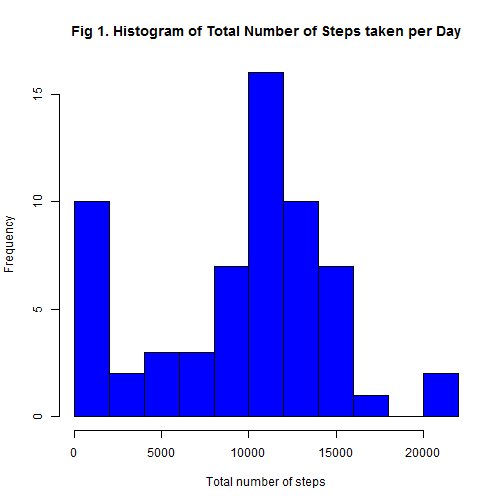
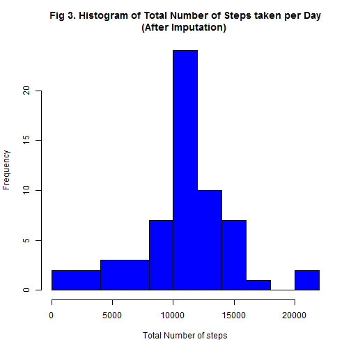
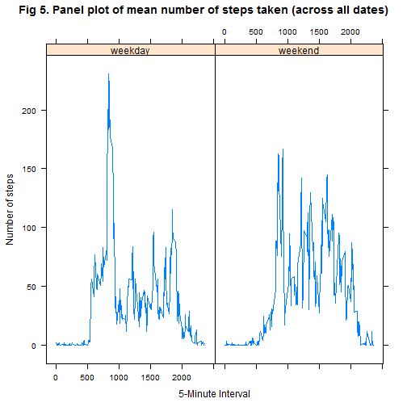

####*Hui-yu Yang*
####*July 13 2015*

**Goal:** <br>
For this analysis, we performed an exploratory analysis on 2 months of data on the number of steps taken per 5-minute interval throughout the day from an anonymous individual. The goal is not only to discover the trend of average total number of steps taken per day and the average daily activity pattern, but also discern the differences in activity patterns between weekdays and weekends (after imputation of missing values). 
<br><br>

**List of variables:** <br>
1. steps: Number of steps during each 5-minute interval <br>
2. date: date on which the measurement was taken <br>
3. interval: identifier for the 5-minute interval for steps (variable 1 above) 
<br><br>
**Data:** The data used for this document can be downloaded [here](https://d396qusza40orc.cloudfront.net/repdata%2Fdata%2Factivity.zip)

###I. Loading and preprocessing the data 


```r
## set working directory and load data
setwd("C:/Users/Moo/Documents/Coursera/Data Science Specialization/5. Reproducible Research/RepData_PeerAssessment1")
data <- read.csv("activity.csv")

## Load packages necessary
library(knitr)
library(lattice)

## make a variable combining date and time
hour <- trunc(data$interval/100)
minute <- data$interval - hour*100
time <- paste(hour,":", minute,sep="")
data$date.with.time <- as.POSIXlt(paste(data$date, time), format="%Y-%m-%d %H:%M")
head(data)
```

```
##   steps       date interval      date.with.time
## 1    NA 2012-10-01        0 2012-10-01 00:00:00
## 2    NA 2012-10-01        5 2012-10-01 00:05:00
## 3    NA 2012-10-01       10 2012-10-01 00:10:00
## 4    NA 2012-10-01       15 2012-10-01 00:15:00
## 5    NA 2012-10-01       20 2012-10-01 00:20:00
## 6    NA 2012-10-01       25 2012-10-01 00:25:00
```

The first few rows of the loaded data were shown above. 

###II. What is the mean total number of steps taken per day? 


```r
## calculate total number of steps taken per day
steps.per.day <- aggregate(data$steps, by=list(date=data$date), FUN=sum,na.rm=T)
names(steps.per.day)[2] <- "steps"

## Make a histogram of total number of steps taken per day
hist(steps.per.day$steps, 
     main="Fig 1. Histogram of Total Number of Steps taken per Day", 
     xlab="Total number of steps", 
     col="blue", 
     breaks=10)
```

 

```r
## Calculate mean and median of total number of steps taken per day
mean1 <- mean(steps.per.day$steps, na.rm=T)
median1 <- median(steps.per.day$steps, na.rm=T)
```

The mean and median of total number of steps taken per day are 9354 and 10395, respectively. 

###III. What is the average daily activity pattern?  


```r
## calculate average daily activity pattern 
avg.by.interval<- data.frame(aggregate(data$steps, by=list(data$interval), FUN=mean, na.rm=T))
names(avg.by.interval) <- c("interval", "avg.steps")
plot(avg.by.interval, type="l", main="Fig 2. Time series plot on Average number of Steps per intervals across dates", ylab= "Average number of steps", col="blue")
```

 

```r
## Find date with max average steps taken
interval.with.max <- avg.by.interval[which.max(avg.by.interval$avg.steps),]$interval
```
On average across all of the days in the dataset, the 835 interval of the 5-minute interval contains the maximum mean number of steps (206 steps). Or we can say "08:35" has the highest mean number of steps. 

###VI. Imputing missing values


```r
## Total number of NA in the dataset
Na.count <- sum(is.na(data$steps))
```
There are 2304 missing values in the dataset. 


```r
## Refill missing values by the mean for the 5-min interval 
combined <- merge(data, avg.by.interval, key="interval", all.x=T)
combined[is.na(combined$steps),]$steps = combined[is.na(combined$steps),]$avg.steps

## Create a new dataset with missing values filled in
new <- combined[order(combined$date,combined$interval),]

## Make a histogram of the total number of steps taken each day
steps.per.day.new <- aggregate(new$steps, by=list(date=new$date), FUN=sum)
names(steps.per.day.new)[2] <- "steps"
hist(steps.per.day.new$steps, 
     main="Fig 3. Histogram of Total Number of Steps taken per Day\n(After Imputation) ", 
     xlab="Total Number of steps", 
     col="blue", 
     breaks=10)
```

 

```r
## Calculate mean and median of total number of steps taken per day
mean2 <- mean(steps.per.day.new$steps)
median2<- median(steps.per.day.new$steps)
```

The mean and median of total number of steps taken per day (after imputation) are 10766 and 10766, respectively. These numbers are both higher than those from section I, but we can see that the mean is more affected by the imputation than the median. Changing from 9354 (before imputation) to 10766 (after imputation), the mean total daily number of steps is now identical to the median. It is a hint that the imputed data resembles the normal distribution better than the original data does, as you can see by comparing Figures 1 and 3.  

###V. Are there differences in activity patterns between weekdays and weekends? 


```r
## create a new factor varaible with 2 levels "weekday" and "weekend"

index <- weekdays(new$date.with.time) == "Saturday" | weekdays(new$date.with.time) == "Sunday"
new$weekday.or.weekend[index] <- "weekend"
new$weekday.or.weekend[!index] <-"weekday"
new$weekday.or.weekend <- factor(new$weekday.or.weekend)

##
new.avg <- data.frame(aggregate(new$steps, 
                                by=list(new$interval, new$weekday.or.weekend), FUN=mean))
names(new.avg) <- c("interval", "weekday.or.weekend","steps")
xyplot(new.avg$steps~new.avg$interval|new.avg$weekday.or.weekend, type="l",
       ylab="Number of steps", xlab= "5-Minute Interval", 
       main="Fig 5. Panel plot of mean number of steps taken (across all dates)")
```

 

Based from Figure 5, we can see that weekdays and weekends seem to exhibit different activity patterns. The activity pattern on weekends is more consistent than that of weekdays, and majority of the steps taken on weekends are around 25 to 175 steps. On the other hand, the steps taken on weekdays are more variable with a peak of more than 200 steps. <br>

However, we have to keep in mind that the result was produced after the imputation. The imputation technique is rather naive and a more suitable technique would depend on the pattern of missingness. With that said, the future step should be plotting the original data (without imputation) and compare the two panel plots and see if they still exhibit similar trends. 

